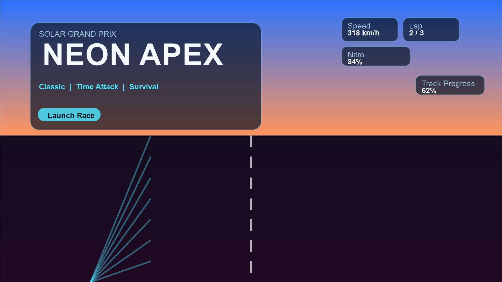
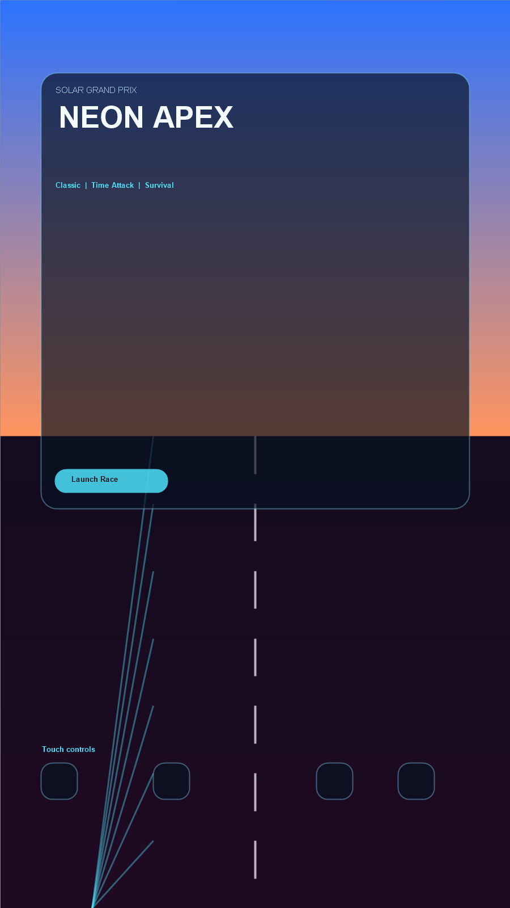

# Neon Apex Racing

`Neon Apex Racing` is a self-contained high-style arcade racing prototype built with plain HTML, CSS, and JavaScript.

Short description: a neon-soaked arcade racer with boost, drift bias, traffic dodging, a reactive day-night cycle, procedural music, and mobile touch support.

## Preview Shots

## Run It

1. Open `index.html` in a browser.
2. Click `Launch Race`.

`index.html` is the entry point, and the project uses relative local paths like `./styles.css`, `./game.js`, and `./screenshots/...` so it can be zipped and hosted as a static web game.

## Publish It

### itch.io

- Upload `releases/neon-apex-racing-itchio.zip`
- Mark it as a browser-playable `HTML` game
- Recommended embed size: `1600 x 900`
- Use [ITCHIO.md](./ITCHIO.md) for the upload checklist and page copy

### GitHub Pages

- The repo is currently rooted at `C:\Users\User\OneDrive\Documents\My Games`, so the Pages workflow lives at `.github/workflows/deploy-neon-apex-racing-pages.yml`
- Push the repo to GitHub, then enable `GitHub Pages` with `GitHub Actions` as the source
- The workflow publishes the `neon-apex-racing` subfolder directly

### Vercel

- Static hosting config is in `vercel.json`
- Once deployed, Vercel will use `index.html` as the entry page automatically

## Features

- Pseudo-3D track rendering with sweeping curves and hills
- Traffic, collisions, boost, drifting bias, lap timing, and best-time saving
- Near-miss combo scoring and collectible surge gates
- Upgraded skybox with aurora ribbons, cloud layers, road sheen, and richer roadside props
- Procedural synth soundtrack generated with the Web Audio API plus in-game music toggle
- Three modes: `Classic`, `Time Attack`, and `Survival`
- Responsive HUD and menu overlay
- Procedural skyline, mountains, particles, and speed effects

## Controls

- `W` / `Up Arrow`: accelerate
- `S` / `Down Arrow`: brake
- `A` / `D` or `Left` / `Right`: steer
- `Space`: nitro boost
- `Shift`: drift bias
- `Q`: horn
- `P`: pause
- Mobile: on-screen steering, throttle, brake, boost, drift, and horn buttons

## Share Checklist

- Desktop sanity check passed in headless Chrome
- Mobile-sized sanity check passed in headless Chrome
- Title screen includes a short description, controls, and preview media
- All asset references are relative and ready for static hosting or ZIP upload
